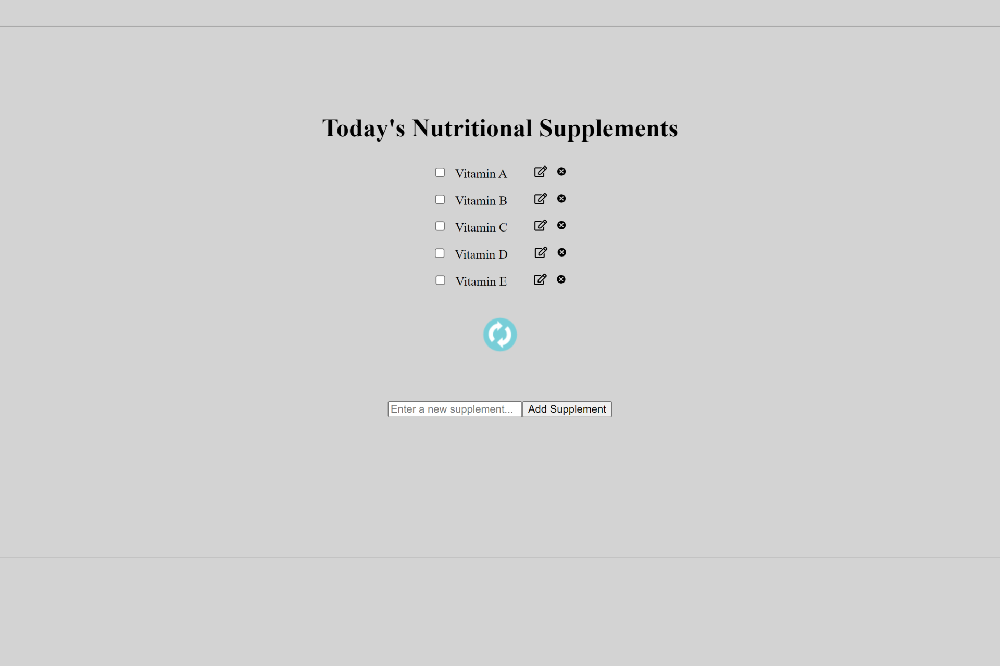

# Wellender - Version 1 (React + Context API)

### A supplement tracking app and more

Live version: https://wellender.netlify.app/

Screenshot:



<!-- toc -->

## Table of Contents

- [Features](#features)
- [Usage](#usage)
  - [Install Dependencies](#install-dependencies)
  - [Run](#run)
  - [Build & Deploy](#build--deploy)

<!-- tocstop -->

## Features

- Supplement tracking
- More to be added soon...

## Usage

### Install Dependencies

```
npm install
```

### Run

```
npm run dev
```

### Build & Deploy

```
npm run build
```
